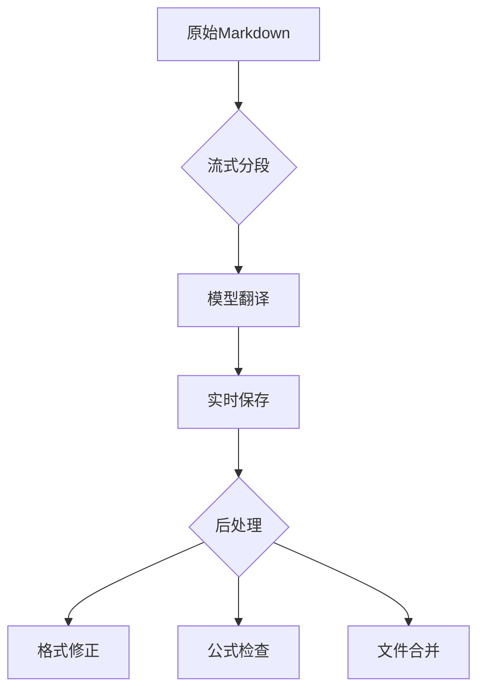

# 学术文档翻译处理系统


基于大模型的智能流式翻译系统，专为处理含复杂数学公式的学术文档设计，支持多模型协同工作。

## 🌟 全新特性

- **流式分段处理**：智能分割大文件，保持上下文连贯性
- **多模型协同**：支持DeepSeek/Claude/GPT等多种模型
- **对话历史维护**：自动维护最近5轮对话上下文
- **智能错误恢复**：分段重试与断点续传机制
- **格式优化引擎**：自动优化LaTeX公式和算法排版

## 🚀 推荐工作流



## 📦 快速开始

1. **环境配置**
```bash
# 克隆项目
git clone https://github.com/yourusername/translation-system.git
cd translation-system

# 安装依赖
pip install -r requirements.txt

# 配置环境
cp .env.example .env
```

2. **编辑配置文件**
```ini
# .env
API_KEYS="your_key_1,your_key_2"  # 支持多个API密钥
BASE_URL="https://api.siliconflow.cn/v1/"
MAX_CONCURRENT=5  # 最大并发数
```

3. **运行流式翻译**
```bash
python streaming.py
```

## 🛠 核心功能详解

### 智能分段处理
```python
# 基于语义的分段算法
def split_content(content: str, max_length: int = 3000) -> List[str]:
    from Segmente import MarkdownSegmenter
    segmenter = MarkdownSegmenter(max_length=max_length)
    return segmenter.segment(content)
```
- 保持章节完整性
- 自动识别公式/算法块
- 上下文感知分割

### 流式处理引擎
```python
async def translate_file():
    # 维护最近5轮对话历史
    k = 5  
    messages = []
    
    for segment in segments:
        # 构建上下文感知提示
        current_messages = [
            {"role": "system", sys_prompt},
            *messages[-2*k:],  # 保留最近k轮对话
            {"role": "user", f"继续翻译：{segment}"}
        ]
        
        # 流式响应处理
        stream = client.chat.completions.create(
            model=MODEL_NAME,
            messages=current_messages,
            stream=True
        )
        
        # 实时写入文件
        with open(output_file, 'a') as f:
            for chunk in stream:
                f.write(chunk.content)
```

### 错误恢复机制
```python
max_retries = 5  # 最大重试次数
retry_delay = exp_backoff()  # 指数退避算法

async def translate_segment():
    while retry_count < max_retries:
        try:
            # 尝试翻译
            return await api_call()
        except APIError:
            await sleep(retry_delay)
            retry_count += 1
```

## 📚 文件类型支持

| 类型 | 说明 | 示例 |
|------|------|------|
| Markdown | 学术论文/技术文档 | `*.md` |
| Text | 纯文本格式 | `*.txt` |

## ⚙️ 高级配置

```python
# streaming.py

# 系统提示词模板
sys_prompts = {
    "md": """[Markdown专用提示]
    1. 保持$$公式块独立
    2. 转换HTML表格为Markdown
    3. 优化代码块缩进""",
    
    "tex": """[LaTeX专用提示]
    1. 保留\begin{}环境
    2. 中文标点与公式符号隔离
    3. 统一数学符号翻译"""
}


## 📊 监控与统计

```bash
# 运行后查看统计信息
[翻译统计]
处理文件: 8
成功段落: 127
失败段落: 3
```

## 🔍 故障排查

常见问题解决方案：
1. **API限流错误**
   ```bash
   # 调整.env配置
   MAX_CONCURRENT=3  # 降低并发数
   RETRY_DELAY=10    # 增加重试间隔
   ```

2. **公式格式错乱**
   ```bash
   # 运行后处理工具
   python dollar_checker.py --fix  # 自动修复
   ```


## 🌍 多语言支持

```python
# 通过修改系统提示词切换语言
sys_prompts["translation"] = {
    "en2zh": "中文学术翻译专家",
    "en2ja": "Japanese academic translation",
    "en2ko": "한국어 학술 번역 전문가"
}
```

## 📄 许可证

本项目采用 MIT 许可证 - 查看 [LICENSE](LICENSE) 文件了解详情。

## 🚀 功能特性

- 多文件批量处理
- Markdown格式保留
- LaTeX公式保护
- 智能分段处理
- 多API负载均衡

## 📦 安装依赖
```bash
pip install -r requirements.txt
```

## 🔧 配置说明
1. 复制环境变量模板
```bash
cp .env.example .env
```
2. 在`.env`中配置API密钥：
```ini
API_KEYS=your_key_1,your_key_2
```