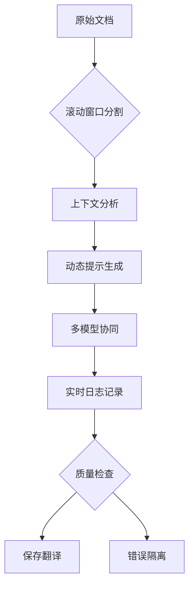

# 学术文档翻译处理系统 3.0


基于深度上下文的智能窗口翻译系统，专为处理长文档的语义连贯性设计，支持动态上下文维护。

## 🌟 3.0 新特性

- **滚动窗口机制**：三窗口上下文感知（前文-当前-后文）
- **动态提示词引擎**：根据上下文自动生成优化提示
- **智能错误隔离**：自动保存错误段落原文到独立目录
- **全链路日志**：完整记录每次API请求和响应
- **分级API池**：主备密钥分离管理，智能切换

## 🚀 推荐工作流



## 📦 快速开始

1. **环境配置**
```bash
# 克隆项目
git clone https://github.com/yourusername/translation-system.git
cd translation-system

# 安装依赖
pip install -r requirements.txt

# 配置环境
cp .env.example .env
```

2. **编辑配置文件**
```ini
# .env
API_KEYS="your_key_1,your_key_2"  # 支持多个API密钥
BASE_URL="https://api.siliconflow.cn/v1/"
MAX_CONCURRENT=5  # 最大并发数
WINDOW_SIZE=3          # 上下文窗口数量
MAX_SEGMENT_LENGTH=4000 # 最大分段长度
LOG_RETENTION=7        # 日志保留天数
```

3. **运行窗口翻译**
```bash
# 3.0版本使用新入口文件
python streaming_window.py
```

## 🛠 核心功能详解

### 滚动窗口机制
```python
# 窗口上下文创建
def create_window(segments: List[str], index: int) -> Tuple[str, str, str]:
    prev = segments[index-1] if index > 0 else ""
    current = segments[index]
    next_seg = segments[index+1] if index < len(segments)-1 else ""
    return prev, current, next_seg
```
- 三窗口上下文维护
- 首尾段落特殊处理
- 动态上下文边界检测

### 动态提示引擎
```python
def build_dynamic_prompt(prev_seg, current_seg, next_seg, 
                        history, total_rounds, current_round, use_r1):
    # 根据上下文动态生成提示词
    user_template = f"""
    【滚动翻译】第{current_round}/{total_rounds}轮
    <<前文>> {prev_seg[:200]}...
    <<当前>> {current_seg[:200]}...
    <<后文>> {next_seg[:200]}...
    """
    return user_template
```

### 智能错误处理
```python
# 错误段落保存路径
ERROR_DIR = Path("errormd") 

async def process_segment(...):
    if is_original:
        error_file = ERROR_DIR / f"error_{output_file.name}"
        with open(error_file, 'a') as f:
            f.write(f"\n错误段落 {index}:\n{translated}")
```

## 📚 文件类型支持

| 类型 | 说明 | 示例 |
|------|------|------|
| Markdown | 学术论文/技术文档 | `*.md` |
| Text | 纯文本格式 | `*.txt` |

## 📊 监控与统计

```bash
# 新增日志目录结构
outputmd/
├── chatlogs/         # 完整对话日志
├── errormd/          # 错误段落存档
└── trans_*.md        # 翻译结果
```

## 🔍 故障排查

新增滚动窗口特有问题解决：

3. **上下文衔接异常**
   ```bash
   # 查看chatlogs中的上下文记录
   tail -n 100 outputmd/chatlogs/filename_chatlog.txt
   
   # 调整窗口大小
   WINDOW_SIZE=5
   ```

4. **长公式断裂**
   ```bash
   # 启用R1模型强制优化
   FORCE_R1=true
   ```

## 🌍 多语言扩展

```python
# 动态提示词支持多语言上下文
sys_prompts["multi_lingual"] = {
    "en2zh": "滚动窗口翻译专家（中英）",
    "en2de": "Deutscher Fachübersetzer mit Kontextfenster"
}
```

## 📜 版本迁移指南

从2.0升级到3.0注意：
1. 配置文件需新增窗口相关参数
2. 输出目录结构变化（新增chatlogs/errormd）
3. API池管理方式改为分级策略
4. 分段策略改为窗口式智能分割

## 📄 许可证

本项目采用 MIT 许可证 - 查看 [LICENSE](LICENSE) 文件了解详情。

## 🚀 功能特性

- 多文件批量处理
- Markdown格式保留
- LaTeX公式保护
- 智能分段处理
- 多API负载均衡

## 📦 安装依赖
```bash
pip install -r requirements.txt
```

## 🔧 配置说明
1. 复制环境变量模板
```bash
cp .env.example .env
```
2. 在`.env`中配置API密钥：
```ini
API_KEYS=your_key_1,your_key_2
```